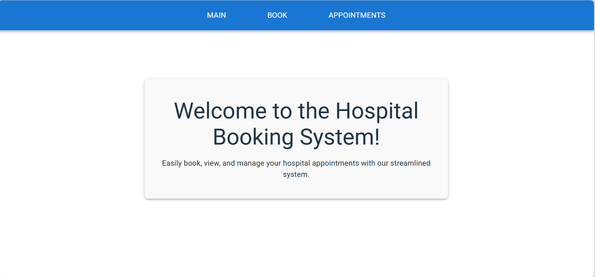
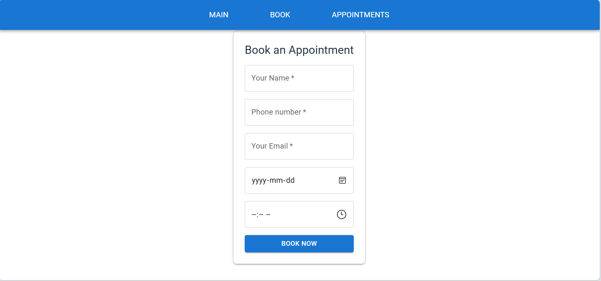

# Appointment Booking System 

This full-stack web application was built to simplify the process of booking, managing, and viewing medical appointments for clinics, solo practitioners, or small healthcare providers. Patients can easily schedule appointments through a user-friendly interface, while staff can view and manage upcoming bookings in real-time.

---

## Features

- Book an appointment with name, email, phone, date, and time
- View all upcoming appointments in a responsive grid layout
- Displays date like `June 6th 2025` and time like `10:00 AM`
- Persistent local H2 database storage
- Navigate between pages using React Router
- Styled with Material UI

---

## Tech Stack

**Frontend:**
- React + TypeScript
- Vite build tool
- Material UI
- Axios
- React Router

**Backend:**
- Java + Spring Boot
- Spring Web, Spring Data JPA
- H2 Database (file-based)

---

## Setup Instructions

### Prerequisites

- Java 17+
- Node.js and npm
- Maven

---

### Run the Backend

```bash
cd backend
.\mvnw spring-boot:run
```
- Visit the API: `http://localhost:8080/api/v1/appointments`
- Access the H2 Console: `http://localhost:8080/h2-console`
- Use `JDBC URL: jdbc:h2:file:./data/testdb`

---

### Run the Frontend
```bash
cd frontend
npm install
npm run dev
```
- Frontend runs on: `http://localhost:5173`

---

### Screenshots



---

## MVP Checklist

- [x] Booking form UI
- [x] Format dates and times nicely
- [x] Page navigation via navbar
- [x] PostgreSQL support for production

---

## Future Improvements
- [ ] Appointment editing
- [ ] Admin login and authentication
- [ ] Responsive mobile design
